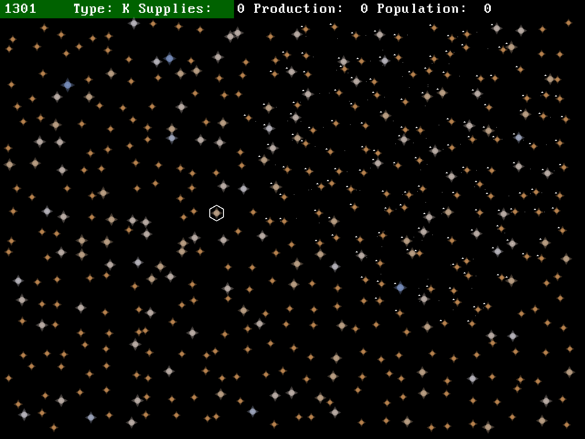

# galaxy



A simple idle-type game in C++ and SFML.

## How to play:

\>TODO<

## Building from source:

```
mkdir build && cd build
cmake ..
cmake --build . [--config Release]
```

## Packaging:

```
cmake --build . --target install
```

Playing once it's packaged:
```
cd galaxy
./galaxy
```

**PROFIT!!!!**